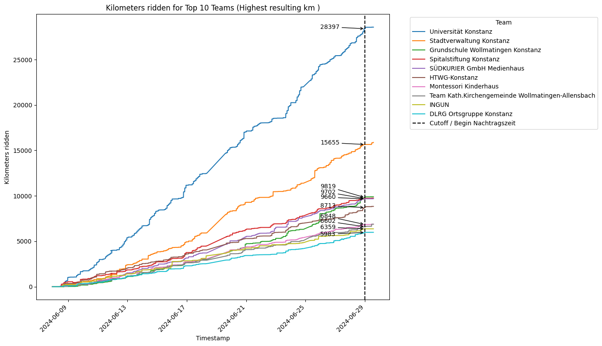
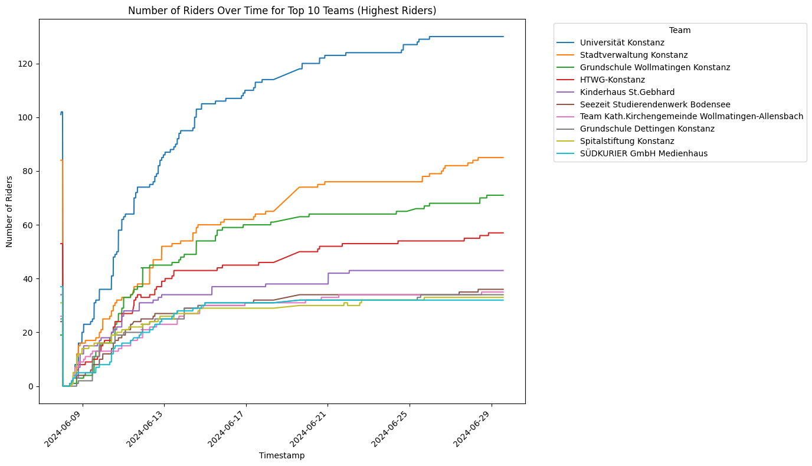
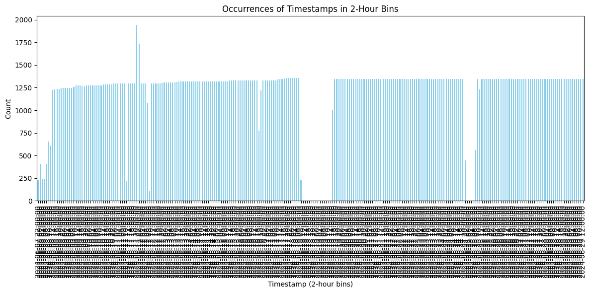

# Stadtradeln Crawling

As of today 29th June 2024, the stadtradeln event for the city of Constance has concluded. 

Currently, there is a week-long timeframe, where furhter submissions are allowed. 

After this week is over, I will upload my **cleaned** raw data and some evaluation figures about it. 

## Crawling Code

The crawling code can be found in [here](https://github.com/Corin-R/stadtradeln/tree/main/scripts)

There is a README explaining the usage and details and possibly changes to the code. 

# Teaser Figures

### Data statistics

