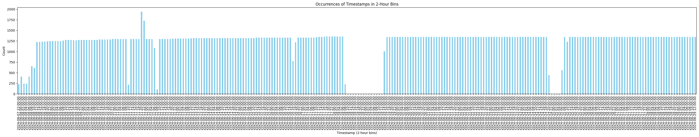

# Stadtradeln Constance Crawling

As of today 29th June 2024, the stadtradeln event for the city of Constance has concluded. 

Currently, there is a week-long timeframe, where furhter submissions are allowed. 

After this week is over, I will upload my **cleaned** raw data and some evaluation figures about it. 

#### Vocabulary

I will refer to some things that needs explaining: 

- active time period: 
The time period where the event was currently ongoing the the city of Constance. Started 2024 - 06 - 08 T 00:00:00 and ended 2024 - 06 - 28 T 23:59:00. 

- passive time period: 
The time period, where the event was over, however it was allowed to submit further rides. This is a week long time period. Started 2024 - 06 - 29 T 00:00:00 and Ended 2024 - 07 - 05 T 23:59:00. 

## Crawling Code

The crawling code can be found in [here](https://github.com/Corin-R/stadtradeln/tree/main/scripts)

There is a README explaining the usage and details and possibly changes to the code. 

# Analysis

Before we start with the analysis, note that I will only provide helpful Figures that produce some insights in the event. 

What we can conclude from them is left to the readers

## Kilometers traveled by top 10 teams

The second figure is a closeup of the first week where the competition was quite fierce. 

The blue columns mark the respective weekends. Naturally, the event for Konstanz started at a Saturday and ended on a Friday. 

## Participating Riders per team 

## Weather

The wether data was downloaded after the event from meteoblue.com 

## Tables

In the following, two tables are presented. 

These tables show the **increase** in a given time period for a team. 

If a team is present in the following tables, it is in the top 10 teams of a specific category. 

The categories are sum of km, riders, rides and km per head. 

To explain with an example: 

The team Stadtverwaltung Konstanz had 85 new participating riders in the active period whereas 3 new participating riders in the passive period. 

Likewise, the team Stadtverwaltung submitted 15655 km in the active period and 1741 km the passive period. 

### Top Teams by category in the active period

|team                                                | sum_km | riders |  rides |  km_per_head |
|---                                                |---:     |---:     |---:    |---:|
|Universität Konstanz                                | 28397 | 130 |  3112 |  218 |
|Stadtverwaltung Konstanz                            | 15655 | 85 |  2032 |  184 |
|Grundschule Wollmatingen Konstanz                   | 9819 | 71 |  1606 |  138 |
|Spitalstiftung Konstanz                             | 9702 | 33 |  983 |  294 |
|SÜDKURIER GmbH Medienhaus                           | 9660 | 37 |  836 |  302 |
|HTWG-Konstanz                                       | 8713 | 57 |  954 |  153 |
|Montessori Kinderhaus                               | 6848 | 31 |  1012 |  221 |
|Team Kath.Kirchengemeinde Wollmatingen-Allensbach   | 6602 | 35 |  661 |  189 |
|INGUN                                               | 6359 | 22 |  425 |  289 |
|DLRG Ortsgruppe Konstanz                            | 5983 | 27 |  863 |  222 |
|Mountainbike Club Konstanz e.V.                     | 2377 | 1008 |  155 |  204 |
|Kinderhaus St.Gebhard                               | 3644 | 43 |  776 |  85 |
|Seezeit Studierendenwerk Bodensee                   | 5035 | 36 |  698 |  140 |
|Grundschule Dettingen Konstanz                      | 4746 | 34 |  460 |  140 |
|Christiani-Team                                     | 3588 | 17 |  1124 |  224 |
|Taylors Treter Truppe                               | 5415 | 31 |  846 |  175 |
|Alt aber zäh                                        | 670 | 1 |  14 |  670 |
|Zwilab                                              | 3725 | 10 |  293 |  373 |
|Bauphysik for Future GSA                            | 2604 | 7 |  261 |  372 |
|Eule                                                | 737 | 2 |  29 |  369 |
|ADFCTeam                                            | 5399 | 16 |  385 |  337 |
|Health for future                                   | 2245 | 7 |  231 |  321 |
|Hämmerle-Recycling                                  | 958 | 3 |  107 |  319 |
|Team Dingelsdorf                                    | 2874 | 9 |  176 |  319 |
|KNIME Cycling                                       | 3158 | 10 |  134 |  316 |
|CineStar Konstanz                                   | 1871 | 6 |  95 |  312 |

### Top Teams by category in the passive period

|team                                               | sum_km | riders | rides | km_per_head |
|---                                                |---:     |---:     |---:    |---:|
|Stadtverwaltung Konstanz                           | 1741   | 3 | 201 | 14 |
|Universität Konstanz                               | 1675   | 5 | 214 | 6 |
|Offenes Team - Konstanz                            | 1551   | 9 | 105 | 16 |
|Team Kath.Kirchengemeinde Wollmatingen-Allensbach  | 1181   | 0 | 107 | 33 |
|RoboRiders                                         | 794    | 1 | 14 | 59 |
|Zeppelin-Gewerbeschule Konstanz                    | 674    | 0 | 29 | 36 |
|HTWG-Konstanz                                      | 612    | 1 | 107 | 8 |
|Health for future                                  | 443    | 0 | 24 | 63 |
|Grundschule Wollmatingen Konstanz                  | 428    | 0 | 86 | 6 |
|Agentur für Arbeit Konstanz                        | 425    | 0 | 18 | 35 |
|Abteilung Tagesbetreuung für Kinder                | 393    | 1 | 170 | 13 |
|BSZ Konstanz                                       | 153    | 1 | 11 | 10 |
|Gemeinschaftsschule Gebhard Konstanz               | 278    | 1 | 49 | 6 |
|Hyperstone Swissbit                                | 316    | 1 | 58 | 9 |
|Mountainbike Club Konstanz e.V.                    | 162    | 1 | 9 | 13 |
|Wessenberg-Schule Konstanz                         | 351    | 0 | 89 | 24 |
|Spitalstiftung Konstanz                            | 423    | 1 | 62 | 5 |
|Team Dingelsdorf                                   | 358    | 0 | 5 | 40 |
|Los geht’s                                         | 74     | 0 | 6 | 37 |
|Kliniken Schmieder Konstanz                        | 391    | 0 | 31 | 32 |
|dreifive                                           | 310    | 0 | 23 | 28 |
|TINK GmbH                                          | 132    | 0 | 22 | 26 |

### Data statistics

This figure displays how many times a date appears in the original data. 

With this figure, we can easily identify what went wrong while crawling. 

Most importantly, there are two major gaps.

The first gap spans from 18.06 at 08:00 to 19.06 at 14:00 

The second gap spans from 24.06 at 20:00 to 25.06 at 08:00

The first gap was a mishap from me, when I did not notice that the crawl has suspended. The second gap was me having a good nights rest and noticing at the morning. 

Relatively speaking in the beginning on the 11.06 my PC had a forced windows update, which resetted my time to UTC. That is why there are some timestamps missing at 10:00. 

There are some duplicate timestamps at 20:00 the same day, which is attributed to me resetting my time to local time again. 

Lesson learned, I will timestamp my crawl using utc and not local pc time. 

### Further comments

Since this event is a yearly event, I will crawl the code again as well and post updates here :) 

If you have any questions or suggestions what is nice to be tracked / analysed, please feel free to contact me. 

What I will add in my next crawl 

- Weather data
- More consistent crawling and backups to not lose data
